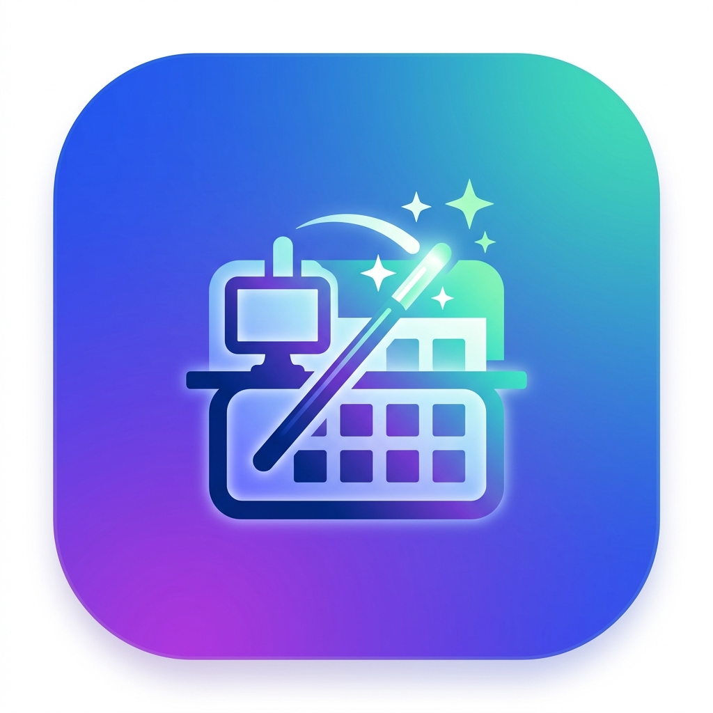

# AutoRoomzio 🚀

AutoRoomzio est une application mobile intelligente conçue pour automatiser vos réservations de bureau sur la plateforme **MyRoomz**. Fini les oublis et le stress de trouver une place, l'application s'en charge pour vous en tâche de fond !

<p align="center">
  
</p>

## ✨ Fonctionnalités principales

- **Pilote Automatique (Background Task)** : Définissez vos jours de présence réguliers. AutoRoomzio se réveille silencieusement en tâche de fond chaque jour pour réserver votre bureau préféré à l'avance (jusqu'à 13 jours).
- **Plan 2D Interactif & Configuration Intelligente** : Lors de la configuration, choisissez votre site et étage, puis sélectionnez votre bureau directement sur une **carte 2D interactive** de vos locaux. Zoomez, déplacez-vous, et repérez la verdure !
- **Calendrier Intégré & Transparence d'Occupation** : 
  - Visualisez vos réservations confirmées (vert), vos jours planifiés par l'automate (bleu).
  - Si quelqu'un d'autre a pris votre place, le calendrier l'affiche (gris) et vous indique **qui a réservé le bureau** !
  - Gestion des réservations "Ailleurs" (orange) si vous avez réservé un autre espace pour la journée.
- **Gestion des Congés 🏖️** : Ajoutez une période d'absence en quelques clics. L'application annulera automatiquement vos réservations sur cette période et suspendra ses tentatives d'automatisation.
- **Assistant de Permissions Android** : Un écran dédié vous guide pas-à-pas (avec images explicatives) pour configurer les permissions critiques comme la désactivation de l'économie d'énergie et l'**AutoStart** (indispensable pour les marques comme Xiaomi, Huawei, Oppo).
- **Connexion Sécurisée et Rapide** : Extraction automatique du token de session depuis votre compte MyRoomz via Webview.
- **Ultra-personnalisable** : 
  - 5 couleurs de thèmes premium et support complet du Mode Sombre.
  - Notifications intelligentes (succès ou échec de réservation).

## 🚀 Installation & Compilation

1. **Prérequis** : Vous devez avoir [Flutter](https://docs.flutter.dev/get-started/install) installé sur votre machine (version 3.13+).
2. **Cloner le projet** :
   ```bash
   git clone https://github.com/Xris65/AutoRoomzio.git
   cd AutoRoomzio/app
   ```
3. **Installer les dépendances** :
   ```bash
   flutter pub get
   ```
4. **Générer l'APK** (Android) :
   ```bash
   flutter build apk --release
   ```
   *L'APK sera disponible dans `build/app/outputs/flutter-apk/app-release.apk`.*
   *Note : Un script `build_apk.bat` est également disponible à la racine du projet sous Windows.*

## ⚙️ Configuration (Release Please)

Ce dépôt utilise **GitHub Actions** et **release-please** pour gérer automatiquement les versions.
- À chaque push avec un commit conventionnel (ex: `feat: nouvelle fonctionnalité`, `fix: correction de bug`), une Pull Request est automatiquement générée.
- Lors de la fusion de cette PR, un tag de version est créé, le `CHANGELOG.md` est mis à jour, et l'application est compilée et publiée dans l'onglet **Releases** de GitHub.

## 🔒 Sécurité et Vie Privée

- AutoRoomzio ne stocke pas vos mots de passe. L'application récupère directement un jeton d'accès sécurisé en naviguant sur l'interface de MyRoomz via un Webview.
- Toutes les requêtes de réservation sont effectuées localement sur votre téléphone vers l'API officielle de MyRoomz, aucune donnée personnelle n'est interceptée ni stockée sur des serveurs tiers.
